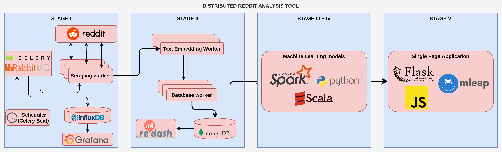

# L2 - 2019

## Scope

1. Docker - Dockerfile, docker-compose, containers in general
2. Python - pip, requirements
3. Celery
4. Task queue

## Tasks
Implement the fist stage of the following architecture:

Detailed information about components can be found in the further tasks.

1. Investigate existing codebase:
    - why we use a broker
    - why there is no broker URL defined in code
    - how the broker URL is build (what is guest etc.)
    - change RabitMQ logs to appropriate severity (warning)
    - do tasks need to return results?
    - can we schedule periodical tasks?
    - why the worker is logging twice? can we fix that?
    - why we can see celery errors at the beginning?
    - what is the context of docker image building process defined in docker-compose file?
    - can we somehow exclude some files from docker image building context?
2. Decide if you are using an API approach or scrapping based approach. Create fine-grained tasks for everything.
    - Scrapping approach
        1. Implement Reddit submission URL provider that will create appropriate tasks
        2. Implement submission scrapper that utilizes the provided URL and fetch submission data:
             - check further tasks to know what date you will need
    - API approach
        1. Get credentials
        2. Select client lib
        3. Create code that will create tasks required for submission fetching
        4. Create code that will consume tasks and fetch submissions
3. Take care of new submissions fetching. Add appropriate task scheduling, that will fetch new submissions. (How to check if the submission is new? Utilize current time, submission creation time, schedule interval)
4. Add process monitoring:
    - Utilize Prometheus or InfluxDB (add them to docker-compose, remember about volumes for data persistency)
    - Publish some metrics about the data fetching process (submission counts, lengths, properties distributions, timings etc.) at least:
        - submission fetch times (avg, histogram)
        - 2 counters 
        - 2 distributions (histogram)
    - publish general celery metrics (you can use a library)
    - Visualize metrics using Grafana (add it to docker-compose, remember about volume for dashboard persistency)

