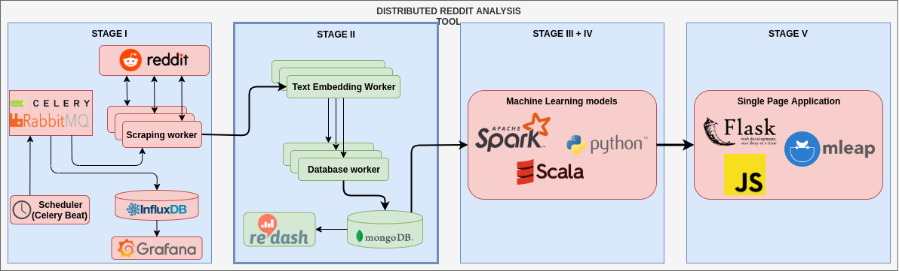

# L4 - 2019

## Scope
1. pySpark
2. Linear regression
3. Binary classification
4. Multi-class classification

## Tasks
Implement the third stage of the following architecture:

Detailed information about components can be found in further tasks.

For each task make sure that `tox` passes.

**Please do not modify the provided tox manifest!**

0. **Preparation** 

    Copy appropriate source code from the previous task into this repository to be able to access gathered data

1. **Start questions**

    - [Guide](https://spark.apache.org/docs/latest/ml-guide.html)
    - why do we need to install Java, how pySpark works?
    - do we need to use Java 8
    - can we connect to an external cluster from python code
    - can we deploy our python code to Spark cluster
    - how can we observe Spark jobs progress (Spark HTTP UI)
    - logistic regression vs linear regression
    - multi-class vs multi-label
    - Spark:
        - what is RDD
        - what is DataFrame
        - what is DataSet
        - how Spark generally works (master, worker)
        - Spark stack (SQL, ML, GraphX etc.)
        - shuffling
        - [reduceByKey vs groupByKey](https://jaceklaskowski.gitbooks.io/mastering-apache-spark/spark-rdd-shuffle.html)

2. **Spark installation** 

    Update Dockerfile and docker-compose:
    - download and instal Spark
    - run code using pySpark command

3. **MongoDB connection** 

    Read data from mongodb using SparkSQL and appropriate connector. 

    - You need to add jar to Spark runtime, use --packages flag for pySpark
    - mongodb needs to be a separate service in docker-compose, utilize appropriate directives to get connections

4. **Data split** 

    Divide data into training and testing sets using some criterion (date of acquisition, first n items)

    - you can use appropriate ready to use the class from Spark

5. **Regression**

    Create regression pipeline:

    - select a submission attribute that we want to be our dependent variable
    - map data to contain a dependent variable and features vector columns
    - create ML pipeline
    - evaluate your regressor using RMSE on train and test sets

6. **Binary classification**

    Create a binary classification pipeline:

    - select a submission attribute that we want to be our class
    - map data to contain class and features vector columns
    - create ML pipeline
    - evaluate your classifier computing F1 metric

6. **Multi-class classification**

    Create a multi-class classification pipeline:

    - select a submission attribute that we want to be our class (multi-class)
    - map data to contain class and features vector columns
    - create ML pipeline
    - evaluate your classifier using MulticlassClassificationEvaluator